## Health Analytivs - Angular Project

The health analytics gives the choropleth map about different categories as per states.

For example:
Selecting Category Obesity/ Weights , For the year 2018, View by Gender Female. 
The Choropleth map is generated as shown below. 

Here the legend are also dynamically generated as per the data fetched.

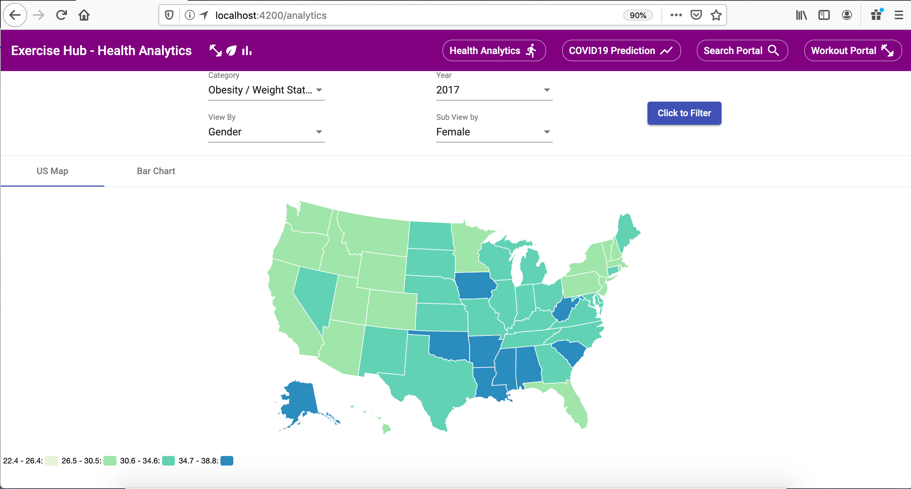

Here is another example:
The Category is Physical activity, the year 2017 and View by Race & Ethnicity with American Indian/Alaska Native.

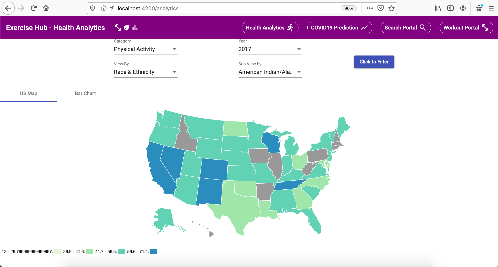

Along with choropleth map, there is also Bar Chart rendered with all states data.

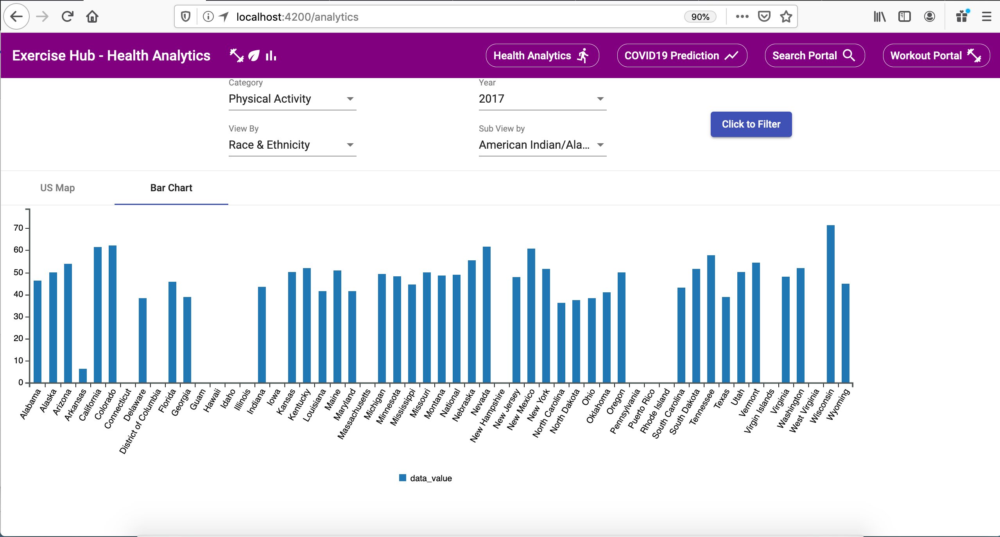

### COVID-19 Predictor:

Time Series Forecasting with LSTMs for Daily Coronavirus Cases 
Here we use  LSTMs to predict future Coronavirus cases based on real-world data.

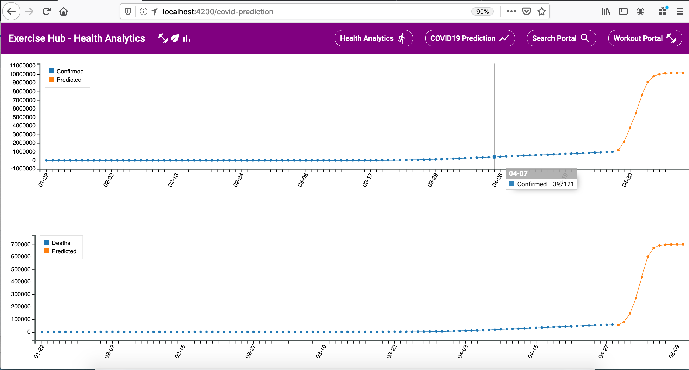

### Search Facilities:

The search portal will open listing all the fitness centers using with the user’s default location. We can  change the radius from 5 miles and move up to 50 miles

This is show below in the screenshot.

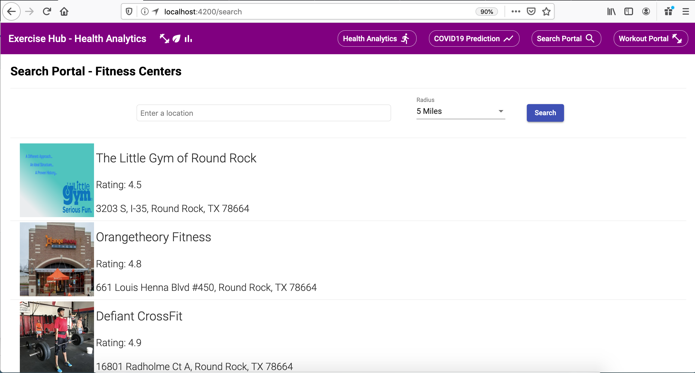

We can also enter the address and search for fitness centers. This is shown below.

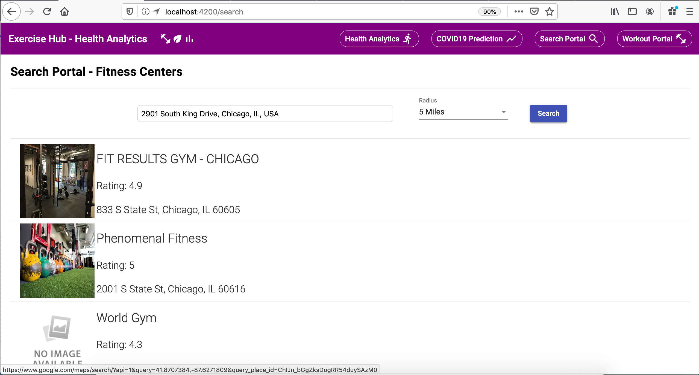

Once we click the fitness center, it opens google maps and use can use the directions and go there.

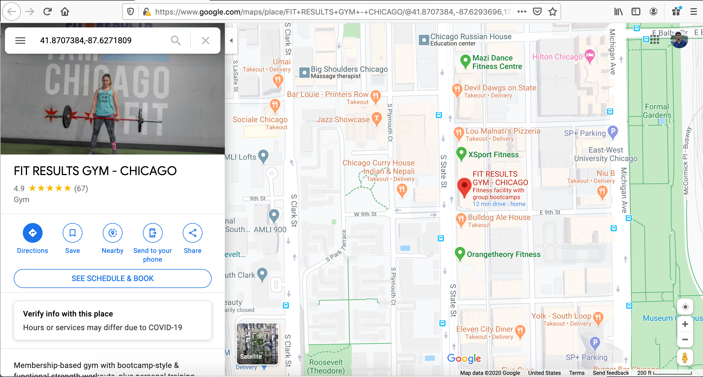

### Workout Portal:

The workout portal displays all the exercises, categorizing based on muscle groups.

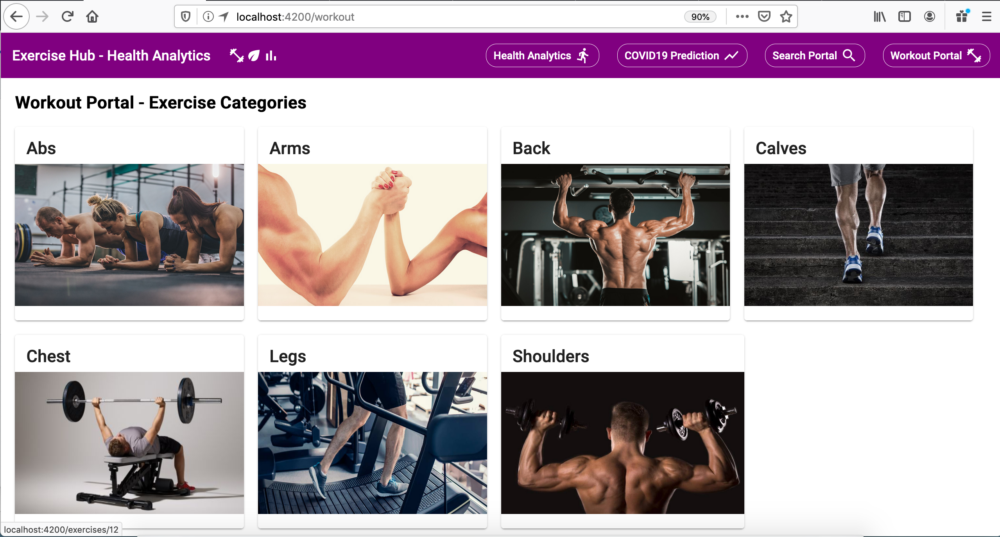

On selecting the muscle group, say for example Abs, It shall list all the exercises for Abs.

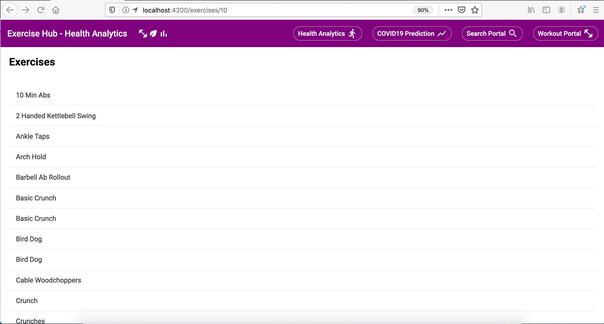

Selecting an exercise, say crunching with cable, it fetches the details how the exercise should be performed and what muscles are impacted. This also highlights the muscle on the muscle anatomy.

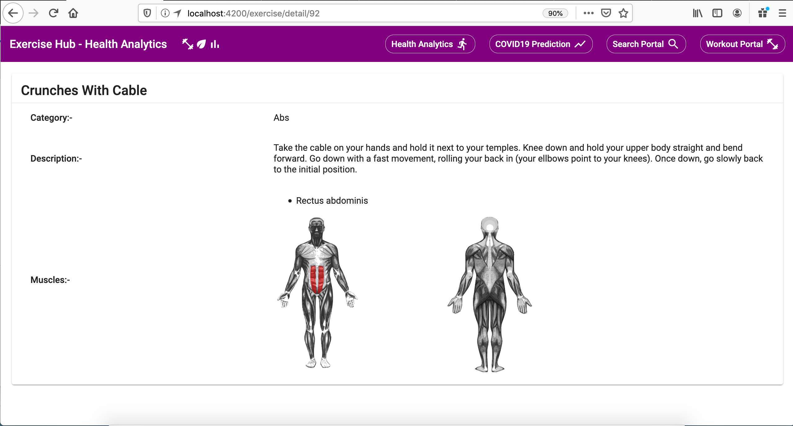

Here is another example of muscle anatomy for Deadlifts.

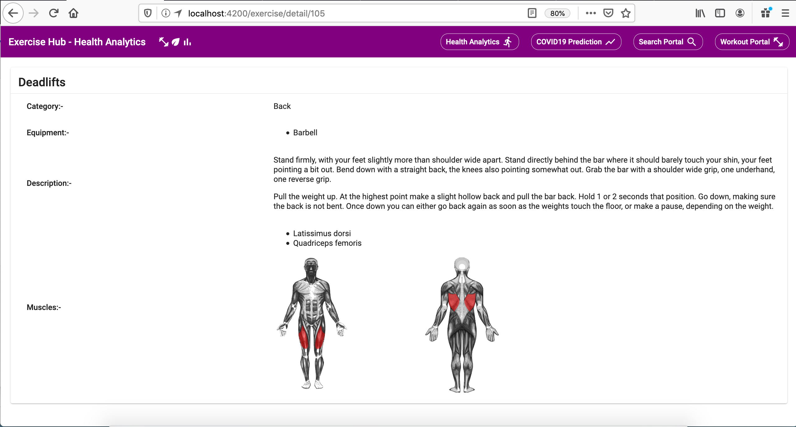